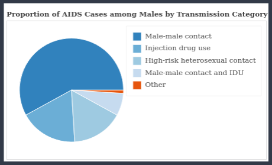

# Getting-started

## 2019-12-19

Today I'm starting this whole thing as a [vacation](https://i.chzbgr.com/original/7876465408/hD3CCA60A/) project.

I've just created this repo to help me to stay focused on what I'm doing and as a way to improve my productivity.

Read:
* [MyStory: How I became a Data Science Analyst from a Software developer?](https://www.analyticsvidhya.com/blog/2017/01/mystory-how-i-became-data-science-analyst-from-software-developer/)
* [Should I become a data scientist (or a business analyst)?](https://www.analyticsvidhya.com/blog/2014/09/become-data-scientist-business-analyst/)

Talked to a friend of mine about this vacation project and if it's desirable to have a master degree on CS/Statistics and about future plans. Right now, I can't help myself but to feel overwhelmed with all the things caught in my mind, all the things all have to go through to "get there". Will I make it? To be fair, I do have the opportunity and I'm in a very good position to do this. I can do this. Will I though?

Studied the following content:
* [Absolute Deviation Demonstration](http://onlinestatbook.com/2/summarizing_distributions/median_sim.html)
* [Squared Differences Demonstration](http://onlinestatbook.com/2/summarizing_distributions/mean_sq_sim.html)
* [Balance Scale Demonstration](http://onlinestatbook.com/2/summarizing_distributions/balance.html)

I'm really getting the feeling that I should plan this thing better. The content I just saw it ok, but too entry-level. I'm kind of leaning towards a book a approach maybe, because the course to follow is clearer.

Starting to take a look at this book: [Introduction to Probability, Statistics, and Random Processes](https://www.probabilitycourse.com/)

## 2019-12-20

Yesterday I've got to review some stuff of sets and read the preface of [Introduction to Probability, Statistics, and Random Processes](https://www.probabilitycourse.com/). So today I plan to continue studying this book. Guess I'm also going to keep my notebook at hand for some note keeping and for drafting some ideas.

Solved a problem of sets cardinality.

Some theorems on sets countability.

Useful definitions from the book:
>_Outcome: A result of a random experiment._  
>_Sample Space: The set of all possible outcomes._  
>_Event: A subset of the sample space._

## 2019-12-22

Continuing book reading.

Studied:

>[1.3 Random Experiments and Probabilities](https://www.probabilitycourse.com/chapter1/1_3_1_random_experiments.php)  
>[1.4 Conditional Probability](https://www.probabilitycourse.com/chapter1/1_4_0_conditional_probability.php)  

I'm basically done with the basic concepts. I might return to the other chapters of this book for some reference. Also, next semestre at my college I'll be attending a probability course, that should fill in the gaps. By now I'll focus on the chapters about inference:
* [Statistical Inference I: Classical Methods](https://www.probabilitycourse.com/chapter8/8_1_0_intro.php)
* [Statistical Inference II: Bayesian Inference](https://www.probabilitycourse.com/chapter9/9_1_0_bayesian_inference.php)

>_Statistical inference is a collection of methods that deal with drawing conclusions from data that are prone to random variation._

Actually, I'm missing some background on random variables as I noted reading through. So, back to chapter 3: [Discrete Random Variables](https://www.probabilitycourse.com/chapter3/3_1_1_random_variables.php). 

I've read through utill [Probability Mass Function (PMF)](https://www.probabilitycourse.com/chapter3/3_1_3_pmf.php).

I'm going to start [Independent Random Variables](https://www.probabilitycourse.com/chapter3/3_1_4_independent_random_var.php) next day. That's all by now.

## 2019-12-29

I'm wrapping up the section _3.1 Random Variables - Basic Concepts_.

I've Covered _3.1.4 Independent Random Variables_ and _3.1.5 Special Distributions_. I haven't dedicated much time to the last aforementioned section as I'll just look the specific distribution when needed. Also, I've reviewed Newton's Binomial Series and dedicated some time proving .

Imma start _3.2 More about Discrete Random Variables_.

Finished it.

I'm starting now chapter 4: _Continuous and Mixed Random Variables_.

Read the chapter's introduction and _4.1.0 Continuous Random Variables and their Distributions_.

That's it for today.

## 2019-12-31

I've just read section _4.1_ and some bits from _4.2 Special Distributions_, which the later I'll use more as a reference when needed.

I've spent some time reading through bits of the book and researching some related concepts.

Planning to keep reading chapter 5, namely [_5.1.2 Joint Cumulative Distributive Function (CDF)_](https://www.probabilitycourse.com/chapter5/5_1_2_joint_cdf.php).

## 2020-01-05

Studied 5.1.2 and 5.1.3.

I'll finish this chapter and pick up a new book I found on stats.

## 2020-01-08

Finished 5.1 and jumping right into 5.3.

## 2020-01-12

I'm completing my log and searching for some adicional material to study by, preferably practical.

I've started reading _An Introduction to the Science of Statistics: From Theory to Implementation_.

Got something to show today:

